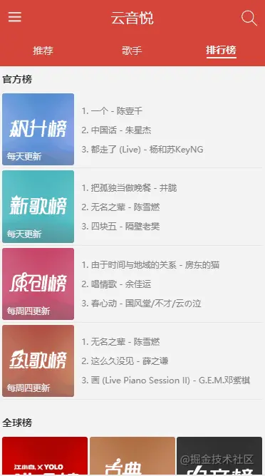
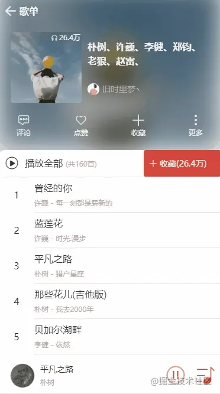

# React Hooks 与 Immutable 实战网易云 WebApp

- 课程地址：[https://juejin.cn/book/6844733816460804104](https://juejin.cn/book/6844733816460804104)
- 课程代码仓库：[https://github.com/sanyuan0704/react-cloud-music](https://github.com/sanyuan0704/react-cloud-music)
- 后端接口采用 github 上开源的 NodeJS 版 api 接口 [NeteaseCloudMusicApi](https://github.com/Binaryify/NeteaseCloudMusicApi)，私有部署地址：[https://musicapi.rscl.cc](https://musicapi.rscl.cc)
- 前端预览地址 [https://y.rscl.cc](https://y.rscl.cc)

## 使用技术

- `react v16.8 全家桶 (react，react-router)`
- `redux`, `react-redux`, `redux-thunk`
- `styled-components`: 处理样式，体现 css in js 的前端工程化神器。
- `immutable`: react 懒加载库
- `swiper`: 轮播图库
- `better-scroll`: 移动端滑动库
- `axios`: 用来请求后端 api 的数据。

## 项目规范

- 1、不再使用 class 组件，统一用 Hooks。
- 2、组件内部状态用 hooks 处理，凡是业务数据全部放在 redux 中管理。
- 3、 ajax 请求以及后续数据处理的具体代码全部放在 `actionCreator` 中，由 `redux-thunk` 进行处理，尽可能精简组件代码。
- 4、每一个容器组件都有自己独立的 reducer，然后再全局的 store 下通过 redux 的 `combineReducer` 方法合并。
- 5、普通 CSS 类名全部用英语小写，单词间用下划线连接，CSS 动画钩子类名中单词用 - 连接。
- 6、凡是 props 中有数据的，全部在组件最前面提前解构赋值，并且，获得的属性名和方法名要分开声明，从父组件获得的 props 和通过 `react-redux` 中映射获得的 props 也要分开声明。
- 7、`mapDispatchToProps` 返回的函数中，函数名格式为 xxxDispatch，以免和现有 action 名冲突。
- 8、每个组件都应用 memo 包裹，使得 React 在更新组件之前进行 props 的比对，若 props 不变则不对组件更新，减少不必要的重渲染。

## 项目整体架构


## 项目演示

推荐歌单列表


推荐歌单详情


歌手列表

> 这里做了异步加载的处理，上拉到底进行新数据的获取，下拉则进行数据的重新加载。


歌手详情


排行榜


榜单详情



播放器内核


播放列表



搜索页


如果要实现路由懒加载，`src/routes/index.js`修改为如下：

```js
import React, { lazy, Suspense } from "react";
import { Navigate } from "react-router-dom";

import Home from "../application/Home";
const RecommendComponent = lazy(() => import("../application/Recommend/"));
const SingersComponent = lazy(() => import("../application/Singers/"));
const RankComponent = lazy(() => import("../application/Rank/"));
const AlbumComponent = lazy(() => import("../application/Album/"));
const SingerComponent = lazy(() => import("./../application/Singer/"));
const SearchComponent = lazy(() => import("./../application/Search/"));

const SuspenseComponent = (Component) => {
  return (
    <Suspense fallback={null}>
      <Component />
    </Suspense>
  );
};

const routes = [
  // These are the same as the props you provide to <Route>
  {
    path: "/",
    element: <Home />,
    children: [
      { path: "", element: <Navigate to="/recommend" /> },
      {
        path: "recommend/*",
        element: (
          <Suspense fallback={null}>
            <RecommendComponent />
          </Suspense>
        ),
        children: [
          {
            path: ":id",
            element: SuspenseComponent(AlbumComponent),
          },
        ],
      },
      {
        path: "singers/*",
        element: SuspenseComponent(SingersComponent),
        routes: [
          {
            path: "/singers/:id",
            component: SuspenseComponent(SingerComponent),
          },
        ],
      },
      {
        path: "rank/*",
        element: SuspenseComponent(RankComponent),
        children: [
          {
            path: ":id",
            element: SuspenseComponent(AlbumComponent),
          },
        ],
      },
      {
        path: "/search",
        element: SuspenseComponent(SearchComponent),
      },
      {
        path: "album/:id",
        element: SuspenseComponent(AlbumComponent),
      },
      // Not found routes work as you'd expect
      { path: "*", element: <Navigate to="/recommend" /> },
    ],
  },
];

export default routes;
```
